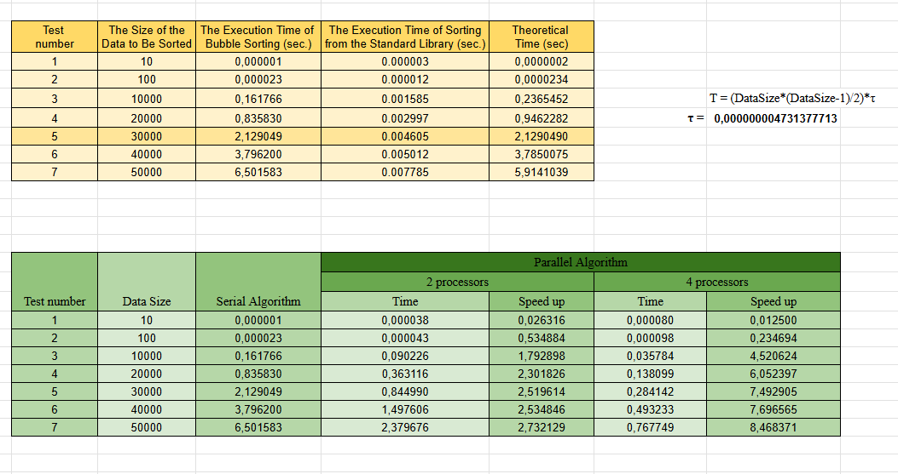

# Lab 04 — Parallel Methods of Data Sorting

---

## Мета роботи:
Метою лабораторної роботи є вивчення принципів паралельної обробки даних та реалізація алгоритму сортування методом бульбашки та його паралельної модифікації — **odd-even transposition sort** — із використанням бібліотеки **MPI (Message Passing Interface)**.

У ході роботи було розроблено послідовну реалізацію алгоритму bubble sort; реалізовано стандартний алгоритм сортування з бібліотеки C++ (std::sort) для порівняння продуктивності; розроблено паралельний алгоритм odd-even transposition з обміном блоків даних між процесами;

---

## Опис реалізації
## Послідовний алгоритм

#### Bubble Sort

 - Класичний алгоритм сортування, який:

 - виконує послідовні порівняння сусідніх пар елементів;

 - переставляє їх місцями, якщо порядок неправильний;

 - виконує n–1 проходів через масив.

**Складність:** $O(n^2)$

#### Сортування стандартною бібліотекою (std::sort)
Використовує Introsort → швидке, гібридне сортування:
 - QuickSort
 - HeapSort
 - InsertionSort
**Складність:** $O(n*log(n))$

## Паралельний алгоритм (MPI)

Паралельне сортування реалізовано за принципом **odd-even transposition sort**, адаптованим для багатопроцесної обробки.

#### Основні етапи паралельного алгоритму

1. Розподіл масиву між процесами
 - нерівномірний поділ за допомогою `MPI_Scatterv`
 - кожен процес отримує блок локальних даних
2. Локальне сортування
 - кожен процес виконує SerialBubbleSort для свого блоку
3. Ітерації odd-even transposition
 - на непарних ітераціях процеси з непарним рангом обмінюються даними із сусіднім справа
 - на парних — процеси з парним рангом
 - виконуються операції: ExchangeData (`MPI_Sendrecv`), merge, split.
4. Фінальна збірка результату
 - `MPI_Gatherv` збирає відсортовані блоки на процесі 0.

---
### Використані MPI-механізми

 - **MPI_Init / MPI_Finalize** — початок і завершення паралельної програми
 - **MPI_Comm_size / MPI_Comm_rank** — кількість процесів і ранг
 - **MPI_Bcast** — розсилка розміру даних
 - **MPI_Scatterv** — розподіл блоків різного розміру
 - **MPI_Sendrecv** — обмін блоками між сусідніми процесами
 - **MPI_Gatherv** — збір нерівних блоків після завершення сортування
 - **MPI_Barrier** — синхронізація у тестових функціях

---

### Результати експериментів

---
### Аналіз результатів
- Speedup для 2 процесів стабільно наближається до ≈2.5×, що є типовим для odd-even transposition.
- Speedup для 4 процесів досягає ≈8×, що навіть перевищує ідеальну лінійну масштабованість для деяких n, через кращу локальність блочних операцій.
- std::sort набагато швидший за паралельний bubble sort — це очікувано, оскільки:
- паралельний алгоритм виконує множинні обміни блоками;
- комунікації `MPI_Sendrecv` суттєво впливають на продуктивність.

