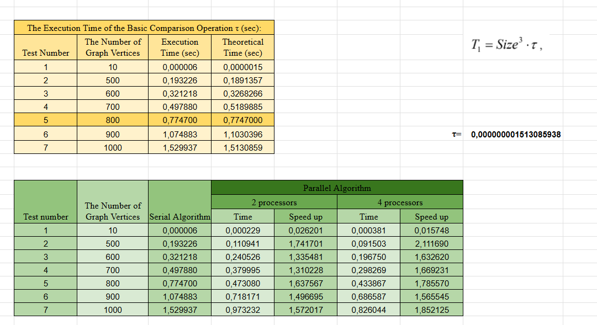

# Lab 05 — Parallel Floyd Algorithm (MPI)

---

### Мета:
Мета лабораторної роботи – ознайомитися з особливостями паралельної реалізації **алгоритму Флойда** (пошук найкоротших шляхів між усіма парами вершин) з використанням бібліотеки MPI, порівняти її з послідовним варіантом та дослідити прискорення на різній кількості процесорів.

---

### Опис реалізації:
## Послідовний алгоритм
Реалізується класичний алгоритм Флойда–Воршелла для матриці суміжності Size × Size.
Вага ребра зберігається в `pMatrix[i * Size + j]`, значення -1 означає відсутність шляху (∞).
Часова складність алгоритму — $O(Size³)$.

## Паралельний алгоритм (MPI)
Паралельна версія ґрунтується на декомпозиції матриці за рядками:

- повна матриця зберігається тільки на процесі rank 0;
- усі рядки діляться між процесами блоками (можлива нерівномірна кількість рядків на процес);
- кожен процес зберігає свою смугу рядків у масиві `pProcRows`.

**Основні етапи:**
**1. Ініціалізація (ProcessInitialization)**
- процес 0 зчитує `Size` з консолі;
- через `MPI_Bcast` розсилається `Size` іншим процесам;
- рахується `RowNum` – кількість рядків, що припадає на поточний процес;
- виділяється пам’ять під локальні рядки; на процесі 0 додатково формується повна матриця з початковими вагами.

**2. Розподіл даних (DataDistribution)**
- використовується `MPI_Scatterv`: кожен процес отримує свій блок рядків матриці;
- розрахунок масивів `pSendNum` / `pSendInd` забезпечує коректне розбиття навіть при `Size`, що не ділиться рівномірно.

**3. Основний паралельний цикл Флойда (ParallelFloyd)**
- для кожного `k` потрібно знати **k-й рядок матриці**:
- функція `RowDistributio` визначає, який процес містить рядок `k`, копіює його у буфер `pRow` і розсилає всім процесам через `MPI_Bcast`;
- кожен процес оновлює лише свої елементи `pProcRows[i * Size + j]` для всіх своїх `i` та всіх `j`, використовуючи отриманий рядок `pRow`:
- таким чином реалізується Floyd–Warshall, але над **розподіленою матрицею**.

**4. Збір результатів (ResultCollection)**
- через MPI_Gatherv локальні блоки рядків збираються на процесі 0 у повну матрицю pMatrix.

**Комунікація:**

- `MPI_Bcast` – розсилка розміру Size та k-го рядка;
- `MPI_Scatterv` – розподіл початкових рядків;
- `MPI_Gatherv` – збір результатів у кінець обчислень;
- `MPI_Barrier` – використовується в тестових/дебагових функціях для синхронізації.

  
---

### Результати експериментів

---

### Аналіз результатів

Для розмірів від 500 паралельний варіант показує стабільне прискорення:

- для 2 процесів — ~1.5–1.7 раза,
- для 4 процесів — до ~1.8–2.1 раза.

Алгоритм Флойда має кубічну складність, тому виграш від паралелізації проявляється тільки на достатньо великих розмірах графа.
Зі зростанням розміру задачі паралельна версія стає ефективнішою, хоч прискорення менше за ідеальне (2 або 4 рази). Реальна ефективність обмежується витратами на міжпроцесну комунікацію.

