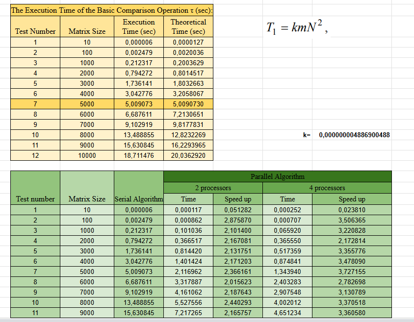

# Lab 06 — Parallel Algorithms of Solving Differential Equations in Partial Derivatives

---

## Мета роботи

Метою лабораторної роботи є ознайомлення з принципами паралельної реалізації ітераційних методів для розв’язання двовимірного рівняння на прямокутній сітці.
У роботі реалізовано:

- послідовний алгоритм методу Гауса–Зейделя;
- паралельний алгоритм з горизонтальним розподілом рядків за допомогою бібліотеки MPI (Message Passing Interface).

---

## Опис реалізації
**1. Послідовний алгоритм**

Послідовна версія програми виконує класичний метод Гауса–Зейделя для наближеного розв’язання рівняння Лапласа.
\[
u_{i,j}^{\text{new}} = \frac{1}{4}\left( 
u_{i-1,j} + u_{i+1,j} + u_{i,j-1} + u_{i,j+1}
\right)
\]

**Основні етапи:**

- побудова квадратної сітки `Size × Size`;
- накладання граничних умов (крайові значення = 100, внутрішні = 0);
- послідовне оновлення всіх внутрішніх вузлів;
- обчислення максимальної зміни `dmax`;
- зупинка, коли `dmax ≤ Eps`.

**2. Паралельний алгоритм Гауса–Зейделя**

Паралельна версія використовує горизонтальний розподіл рядків між процесами MPI.

**Основні кроки алгоритму:**

1. Розподіл даних:
Глобальна матриця розбивається на смуги рядків за допомогою `MPI_Scatterv`.
Кожен процес отримує:
- свої внутрішні рядки,
- два граничні рядки, що необхідні для ітерацій.

2. Обмін граничними рядками:
На кожній ітерації виконується двосторонній обмін рядками з сусідами: `MPI_Sendrecv`.
Це гарантує коректні значення для формули Гауса–Зейделя.

3. Локальні обчислення:
Кожен процес виконує оновлення значень лише в своїй смузі.

4. Глобальна перевірка точності:
Максимальна зміна `ProcDelta` об’єднується у всіх процесах через `MPI_Allreduce` з операцією `MPI_MAX`.

5. Збір результатів:
Після збіжності локальні смуги збираються в повну матрицю: `MPI_Gatherv`.

### Використані MPI-механізми

- `MPI_Scatterv` — нерівномірний розподіл рядків глобальної матриці.

- `MPI_Sendrecv` — обмін двома граничними рядками між сусідніми процесами.

- `MPI_Allreduce` (MPI_MAX) — глобальна оцінка максимального відхилення.

- `MPI_Gatherv` — збирання результатної матриці.

- `MPI_Bcast` — передача параметрів Size та Eps всім процесам.

- `MPI_COMM_WORLD` — основний комунікатор, що охоплює всі процеси.

---

### Результати експериментів

---

### Аналіз результатів
Паралельна реалізація методу Гауса–Зейделя демонструє суттєве прискорення у порівнянні з послідовним алгоритмом, особливо на великих розмірах матриці. Для 2 і 4 процесорів спостерігається стабільне зростання speed-up, яке збільшується разом із розміром задачі. Це пояснюється тим, що для великих N частка обчислень стає домінуючою, а накладні витрати на комунікацію (MPI_Sendrecv, MPI_Allreduce) мають менший вплив.

