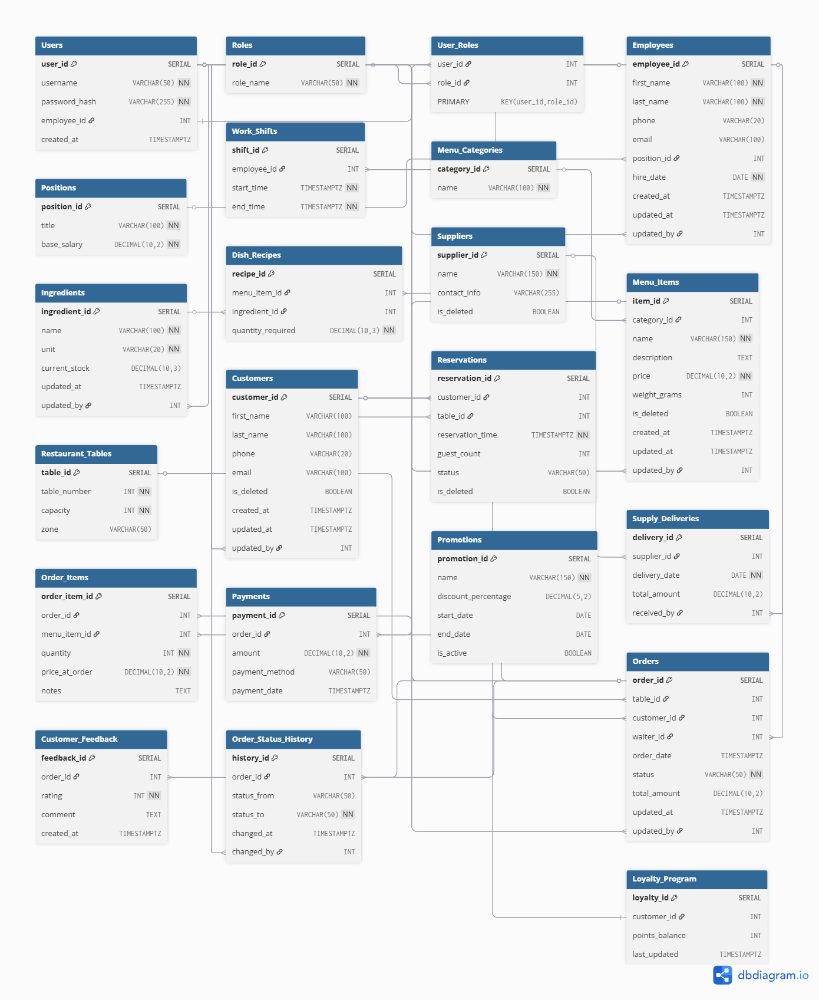

# Варіант №15: Система управління ресторанним бізнесом
---
Проєкт є реалізацією серверної частини системи управління ресторанним бізнесом. Робота виконана з використанням **Python** для реалізації бізнес-логіки (патерни Repository та Unit of Work) та **PostgreSQL 17** як реляційної СУБД для зберігання даних і виконання складних операцій (збережені процедури, тригери).


## 1–2. Схема бази даних

Спроєктовано реляційну схему бази даних `restaurant_db`, яка охоплює повний цикл роботи ресторану: від закупівлі продуктів та управління персоналом до обслуговування клієнтів та аналітики.

**Інструмент проєктування (додано посилання на поточну схему):** [dbdiagram.io](https://dbdiagram.io/d/Restaurant-Management-System-69221507228c5bbc1a0cb61b).

### Візуалізація схеми


### Сутності (22 таблиці)
Схема містить **22 сутності**, розділені на логічні групи:

* **Адміністрування та HR:**
    `Users`, `Roles`, `User_Roles`, `Employees`, `Positions`, `Work_Shifts`.
* **Меню та Склад:**
    `Menu_Categories`, `Menu_Items`, `Ingredients`, `Dish_Recipes`, `Suppliers`, `Supply_Deliveries`.
* **Обслуговування та Операції:**
    `Restaurant_Tables`, `Customers`, `Reservations`, `Orders`, `Order_Items`, `Payments`.
* **Маркетинг та Аналітика:**
    `Promotions`, `Loyalty_Program`, `Customer_Feedback`, `Order_Status_History`.

---

## 3. Підтримка "Soft Delete" та аудиту

### Soft Delete (М'яке видалення)
Для критично важливих сутностей реалізовано механізм логічного видалення. Запис не видаляється фізично, а позначається прапорцем.
* **Поле:** `is_deleted BOOLEAN DEFAULT FALSE`.
* **Сутності:** `Menu_Items`, `Customers`, `Suppliers`, `Reservations`.
* **Реалізація:** Збережені процедури (наприклад, `sp_soft_delete_menu_item`), які оновлюють статус замість видалення.

### Аудит змін
Усі зміни в таблицях фіксуються для відстеження історії.
* **Поля аудиту:**
    * `created_at` — дата створення.
    * `updated_at` — дата останньої зміни (автоматично оновлюється тригером).
    * `updated_by` — ID користувача, що вніс зміни.
* **Механізм:** Тригерна функція `update_timestamp()`, підключена до таблиць `Employees`, `Menu_Items`, `Orders`, `Ingredients`.
* **Глибокий аудит:** Таблиця `Order_Status_History` автоматично зберігає історію переходів статусів замовлення (Open -> Cooking -> Served -> Paid) із зазначенням часу та відповідального.

---

## 4. Реалізація в СУБД PostgreSQL

Вся розроблена схема даних, включаючи таблиці, зв'язки та обмеження, реалізована в СУБД на **PostgreSQL 17**.

Повний DDL- та DML-скрипт знаходиться в папці `lab1/sql/`:
* `schema.sql` — створення таблиць, зв'язків, індексів та обмежень.
* `data.sql` — наповнення бази тестовими даними.
* `logic.sql` — збережені процедури, тригери та представлення.

---

## 5. Використання об’єктів БД

Бізнес-логіка винесена на рівень бази даних через збережені процедури та тригери.

### Збережені процедури (Stored Procedures)
1.  `sp_close_order(p_order_id, ...)` — Транзакційна операція: розраховує суму, створює платіж, закриває замовлення.
2.  `sp_soft_delete_menu_item(p_item_id, ...)` — Безпечне видалення страви.
3.  `sp_restore_menu_item(p_item_id, ...)` — Відновлення видаленої страви.

### Користувацькі функції (Functions)
1.  `fn_get_order_total(p_order_id)` — Динамічний розрахунок вартості замовлення.
2.  `log_order_status_change()` — Тригерна функція для логування змін статусів.
3.  `prevent_delete_active_table()` — Захист цілісності даних (заборона видалення столу з активним замовленням).

### Тригери (Triggers)
* `trg_log_order_status` — Автоматичний запис історії замовлень.
* `trg_prevent_table_delete` — Захист столів від випадкового видалення.
* `trg_..._timestamp` — 5 тригерів для оновлення поля `updated_at`.

### Розрізи даних (Views)
Використовуються для патерну Repository (Read Model):
* `v_active_menu_items` — Меню для клієнтів (приховує видалені позиції).
* `v_order_details_full` — Деталізований звіт для адміністратора (агрегація страв у рядок).
* `v_waiter_performance` — Аналітика ефективності персоналу.

---

## 6. Створення індексів

Для оптимізації продуктивності запитів створено індекси різних типів:
1.  **B-Tree:** `idx_customers_phone` (пошук клієнта), `idx_orders_date` (сортування).
   Стандартний збалансований індекс, який забезпечує миттєвий пошук за точним збігом (телефон) та ефективне сортування діапазонів (дати).
2.  **Partial Index:** `idx_active_menu_items` (індексує тільки `WHERE is_deleted = FALSE`).
   Індексує лише активні записи, ігноруючи "видалені" (Soft Delete), що суттєво зменшує розмір індексу та прискорює завантаження актуального меню.
3.  **GIN Index:** `idx_feedback_search` або `idx_menu_description_search`.
    Спеціалізований індекс для повнотекстового пошуку, який дозволяє ефективно знаходити окремі слова всередині великих текстових полів (відгуки, описи).

---

## 7. Робота з БД із коду (Repository + Unit of Work)

Додаток побудовано на класичній тришаровій архітектурі з використанням патернів **Repository** та **Unit of Work**, що дозволяє чітко розділити відповідальність між базою даних та кодом **Python**.

### Структура файлів
```text
Restaurant_Lab/
├── .env                   # Конфігурація БД (ігнорується Git)
├── .gitignore
├── main.py                # Точка входу (демонстрація)
├── requirements.txt       # Залежності (psycopg2-binary, python-dotenv)
└── restaurant/
    ├── database/          # SQL скрипти та підключення
    │   ├── connection.py
    ├── repositories/      # Шар доступу до даних
    │   ├── base_repository.py
    │   ├── menu_repository.py
    │   └── order_repository.py
    └── unit_of_work/      # Управління транзакціями
        └── unit_of_work.py
```

### Патерни проєктування

#### 1. Repository

Цей патерн виступає посередником між бізнес-логікою та шаром доступу до даних; ізолює SQL-запити. У нашій реалізації він виконує дві ключові функції:

##### Інкапсуляція читання (CQRS – Read Model):

- Замість написання складних `JOIN`-запитів у Python-коді, репозиторії звертаються до **Views** (`v_active_menu_items`, `v_order_details_full`). Це дозволяє отримувати вже підготовлені, агреговані дані (наприклад, чек із переліком страв в одному рядку) простим запитом `SELECT * FROM view`.

##### Інкапсуляція запису (Write Model):

- Усі операції, що змінюють стан даних (`INSERT`, `UPDATE`, `DELETE`), виконуються виключно через виклик **Stored Procedures** (`sp_close_order`, `sp_soft_delete_menu_item`) (гарантія безпеки та цілісності).

#### 2. Unit of Work

Цей патерн керує бізнес-транзакціями. Він гарантує дотримання принципу **ACID** (атомарність, узгодженість, ізольованість, довговічність) на рівні коду.

На практичному прикладі доведено, що реалізація патерну **Unit of Work** забезпечує **атомарність** бізнес-процесів. 
Ми продемонстрували це через сценарій у `main.py`, де виконується ланцюжок дій: видалення страви та закриття замовлення. Система гарантує принцип **"все або нічого"**: база даних ніколи не залишиться у проміжному ("напівзміненому") стані. Навіть у разі виникнення помилки на середині транзакції, механізм **Rollback** автоматично повертає дані до початкового вигляду, забезпечуючи абсолютну цілісність та узгодженість даних у системі.

---

### ДОДАТКОВО: Інструкція по встановленню та запуску

Щоб розгорнути та запустити проєкт на локальному пристрої, виконайте наступні кроки.

#### 1. Передумови

* Встановлений **Python** (версія 3.8 або вище).
* Встановлений та запущений сервер **PostgreSQL** (версія 17).

#### 2. Налаштування Python середовища

Відкрийте термінал у папці проєкту та встановіть необхідні бібліотеки:

```bash
pip install -r requirements.txt
```

#### 3. Налаштування бази даних
1. Створіть базу даних в pgAdmin або через консоль:
```sql
CREATE DATABASE restaurant_db;
```
2. Виконайте SQL-скрипти. Відкрийте Query Tool у вашій новій базі та виконайте вміст файлів з папки `lab1/sql/` у такій послідовності:

 * `schema.sql` — створює таблиці та структуру.

 * `data.sql` — наповнює базу тестовими даними.

 * `logic.sql` — додає процедури, тригери та Views.

#### 4. Налаштування конфігурації
Знайдіть у корені проєкту файл `.env.example`. Створіть на його основі файл `.env`. Впишіть туди ваші реальні дані для підключення до PostgreSQL:
```bash
DB_HOST=localhost
DB_NAME=restaurant_db
DB_USER=postgres
DB_PASSWORD=ваш_реальний_пароль
```

#### 5. Запуск програми
Запустіть головний скрипт для демонстрації роботи системи (Repository + Unit of Work):

```bash
python main.py
```
