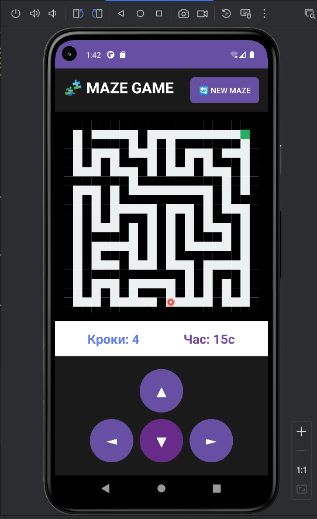

# Lab 03 -  Maze Game (Android Application)

Класична гра-головоломка "Лабіринт", розроблена на Java для платформи Android. Гравець керує об'єктом, намагаючись знайти вихід із процедурно згенерованого лабіринту.

## Візуальний вигляд гри з емулятора 



---

## Опис функціоналу

Гра генерує унікальний лабіринт при кожному запуску. Мета гравця — провести червону точку (персонажа) від старту до зеленого квадрата (виходу).

### Ключові можливості

- **Випадкова генерація:** Лабіринт створюється алгоритмом Recursive Backtracker, що гарантує наявність проходу та цікаву структуру.
- **Розумний спавн:**
  - Точка старту вибирається випадково серед вільних клітинок.
  - Точка виходу автоматично розміщується у найвіддаленішій точці від старту (розраховується за Евклідовою відстанню).
- **Інтерфейс:**
  - Відображення кількості зроблених кроків.
  - Таймер часу проходження рівня.
  - Автоматична зупинка таймера при досягненні виходу.
  - Кнопка "New Maze" для миттєвого перезапуску з новим лабіринтом.
- **Керування:** Екранні кнопки для руху в чотирьох напрямках.
- **Візуальний фідбек:** Гравець змінює колір з червоного на зелений при успішному завершенні.

---

### Технологічний стек

- **Мова програмування:** Java
- **Платформа:** Android (API 21+)
- **Система збірки:** Gradle
- **UI Framework:** Android Views з кастомним Canvas rendering

---

### Структура класів

**1. `MainActivity` (Controller)**
- Ініціалізує гру та зв'язує XML-інтерфейс з логікою Java.
- Обробляє натискання кнопок керування та оновлює лічильники кроків/часу через `Handler`.
- Управляє життєвим циклом компонентів UI.

**2. `GameView` (View)**
- Кастомний компонент, успадкований від `View`.
- Відповідає за малювання (rendering) лабіринту, стін, гравця та виходу за допомогою `Canvas` та `Paint`.
- Обробляє логіку переміщення та перевірку колізій (зіткнень зі стінами).
- Реалізує методи `onDraw()` для відображення та `invalidate()` для оновлення екрану.

**3. `Maze` (Model)**
- Інкапсулює двовимірний масив карти `int[][]`:
  - `0` — прохід (шлях)
  - `1` — стіна
  - `2` — точка старту
  - `3` — вихід
- Реалізує алгоритм генерації лабіринту (DFS - Depth First Search).
- Містить логіку пошуку найдовшого шляху для розміщення виходу.

**4. `Player` (Model)**
- Зберігає координати гравця (X, Y) у сітці лабіринту.
- Надає методи для отримання та оновлення позиції.

---

## Project Structure
```
src/main
├── java/com/example/mazegame
│   ├── GameView.java          # Core game logic and rendering
│   ├── MainActivity.java      # UI controller and event handling
│   ├── Maze.java              # Maze generation algorithm
│   └── Player.java            # Player position management
└── res
    ├── layout
    │   └── activity_main.xml  # Main UI layout
    └── drawable
        ├── button_style.xml       # Control button styling
        └── button_new_maze.xml    # New maze button styling
```

---

## Алгоритм генерації лабіринту

**Recursive Backtracker (DFS-based):**

1. Ініціалізація сітки розміром 21×21 (непарний розмір) з усіма стінами.
2. Вибір стартової точки (1, 1) для генерації.
3. Рекурсивне "прокладання" шляхів:
   - Випадковий вибір напрямку (вгору, вниз, вліво, вправо).
   - Перевірка, чи не відвідана цільова клітинка.
   - Видалення стіни між поточною та цільовою клітинкою.
   - Рекурсивний виклик для нової клітинки.
4. Випадкове розміщення точки старту серед вільних клітинок.
5. Розрахунок точки виходу як найвіддаленішої від старту за Евклідовою відстанню.

## Ігрова механіка

**Елементи лабіринту:**
- Чорні клітинки: стіни (непрохідні)
- Білі клітинки: шляхи (прохідні)
- Зелена клітинка: вихід
- Червоне коло: гравець (стає зеленим при перемозі)

**Статистика:**
- Лічильник кроків: збільшується при кожному успішному переміщенні.
- Таймер: відображає час проходження у секундах, зупиняється при перемозі.

---

## Тестування

Проєкт включає базові тести:
- **Unit тести:** `ExampleUnitTest.java`
- **Інструментальні тести:** `ExampleInstrumentedTest.java`


